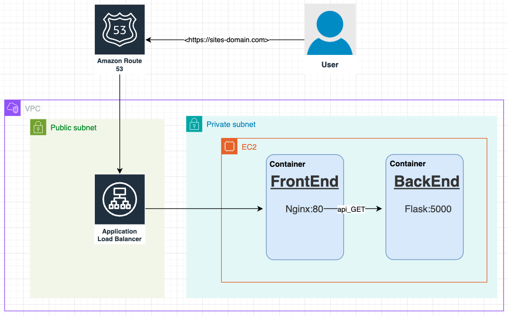
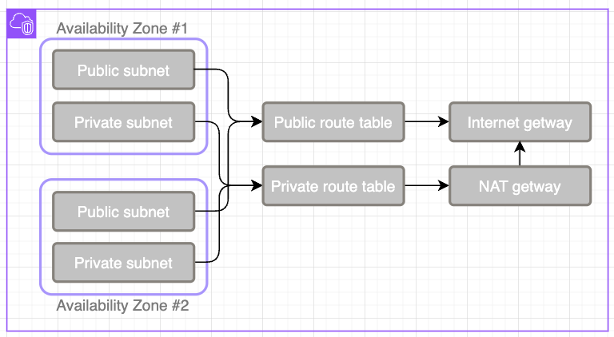
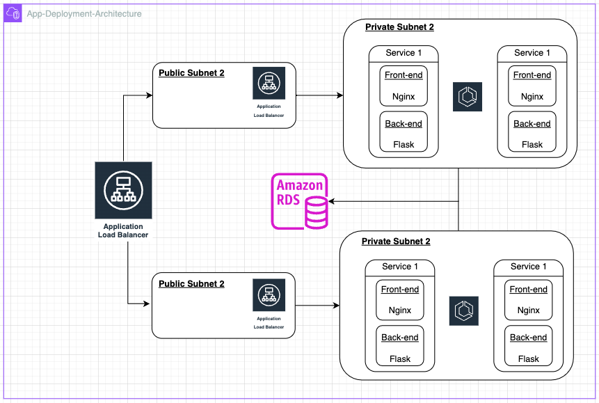
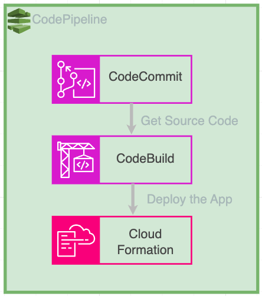
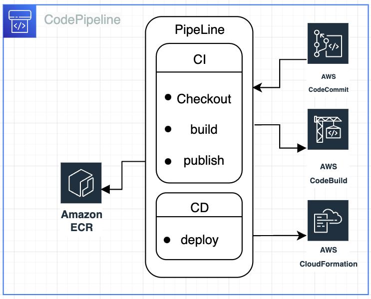

# AWS CloudFormation project

this project contains a [CloudFormation](AWS/cloudformation.yaml) that will create a stack with all the infrastructure required to run simple web app that connects to a MySQL RDS DataBase, queries and displays the information on the web-page ([Web-app](comm-app/Lab/FrontEnd/templates/index.html)).

and another [CloudFormation](AWS/codepipeline-cloudformation.yml) that will create a stack with all the infrastructure required to execute a pipeline that will build updated images and spin up the infrastructure required for the app via the forementioned CloudFormation File.


## Features

- [WebApp-CloudFormation](#WebApp-CloudFormation)
- [Web-App](#Web-App)
- [PipeLine-CloudFormation](#PipeLine-CloudFormation)
- [CodePipeline](#CodePipeline)
- [HTTPS](#HTTPS)


## Web-App

The applications run on two separate containers, one for the frontend part of the application and one for the BackEnd.

the front-end serves a static HTML file from the NGINX server running inside the container, and fetches the data from the back-end container via an HTTP GET request from the back-end container running a flask app.

### Front-end
The front-end of the application uses NGINX to serve a static [HTML](Frontend/labcom.html) file with Java-Script to fetch data from the back end service and also updates the HTML every 60 seconds.

### Back-end
The Back-end of the application run a python [flask app](Backend/main.py) that listens on port 5000 for request from the front-end and return query results from the RDS MySQL server





## WebApp-CloudFormation
this [CloudFormation](AWS/cloudformation.yaml) will create a stack with all the infrastructure required to run simple web app that connects to a MySQL RDS DataBase.

**Important** configure [cloudformation-config](AWS/cloudformation-config.json) before executing the cloudformation!


### Configuration
required configuration for the [cloudformation-config](AWS/cloudformation-config.json):
```sh
{
  "Parameters" : {
    "DBUsername" : "<your desired username for the DB>",
    "Version" : "V1.0", # Set Verison if you're not using CodePipeline
    "HostedZone" : "<Name of the hostedZone in AWS route53>",
    "RecordName" : "<Name of the route53 record>",
    "FrontEndImageRepo" : "<Repository of the FrontEnd image>",
    "BackEndImageRepo" : "<Repository of the BackEnd image>",
    "TLScertificationARN" : "<ARN of the Certificate from ACM>",
    "InstanceAMI" : "<AMI of the amazon-linux 2023 image in your region>"
  }
}
```

#### VPC

The VPC for this CloudFormation creates:
1. 2 public subnets
2. 2 private subnets 
3. 1 public routing table
4. 1 private routing table
5. NAT GateWay for the Private subnets
6. and an InternetGateway for egress



#### RDS

The RDS service that gets created is a MySQL RDS managed service by AWS, the service will only receive inbound communication from the private subnets (change the RDS security group to allow further access).

along with the RDS a new secret will be created and stored in AWS SSM, the secret will store the details to get access into the MySQL server.

### ECS

The CloudFormation will Create an ECS cluster with the service and task required to run the web-application.


### ALB

the CloudFormation will Create an application load balancer that listens on port 443, and forward valid requests (only to the domain through route53) to the ECS cluster, the ALB will terminate the tls connection and communicate with the cluster via http and port 80.




## PipeLine-CloudFormation

**Important** configure [cloudformation-config](AWS/codepipeline-cloudformation-config.json) before executing the cloudformation!


### Configuration
required configuration for the [cloudformation-config](AWS/codepipeline-cloudformation-config.json):
```sh
{
  "Parameters" : {
    "BranchName" : "<branch name to trigger the pipeline>",
    "Repository" : "<specify the repository>",
    "BuildProject" : "<name for the build project>",
    "StackName" : "<name for the stack>",
    "BuildSpecPath" : "<path to the buildspec from with in the repository>"
  }
}
```
this [CloudFormation](AWS/codepipeline-cloudformation.yml) will create a CodePipeline stack that uses CodeCommit as the source code management system, CodeBuild that will build the application docker images, and CloudFormation to deploy the application



## CodePipeline

the code pipeline consist of 3 stages:
1. Source Code Retrieval From CodeCommit on Detected changes
2. Build with CodeBuild the Docker images of the applications, version them and upload to ECR
3. deploy the application using CloudFormation



## HTTPS

### steps to create and attach a valid HTTPS to the service:
1. Obtain a Domain through AWS or any other Domain provider and change NameServers to AWS's
2. Create a route53 Public Hosted Zone for the domain
3. Through AWS ACM Request a managed certificate from AWS to the obtained domain
4. add a CNAME record in the hosted zone you've created to verify ownership of the domain
5. once the certificate is valid you'll be able to attach the certificate to the ALB which will handle that tls connection